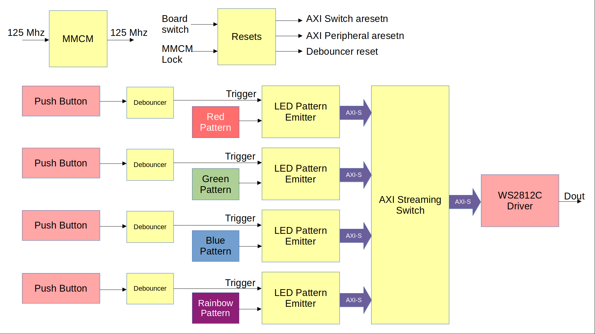
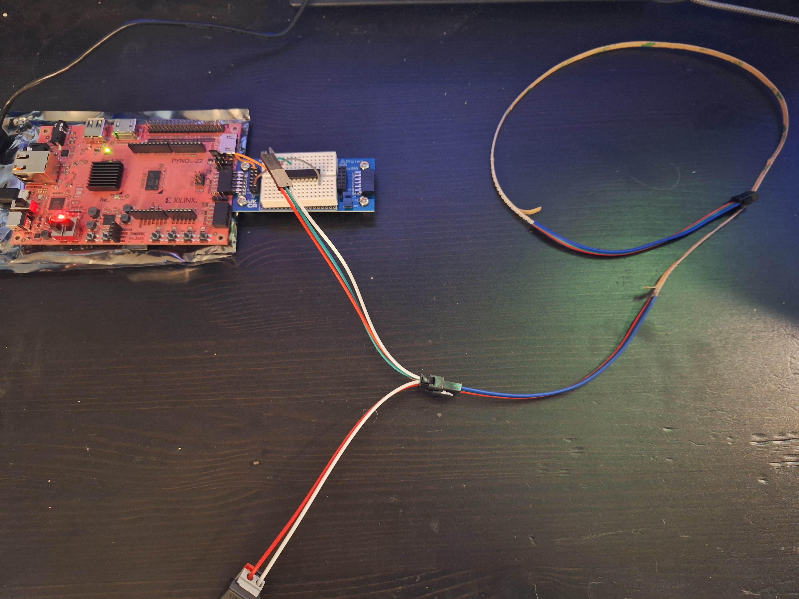
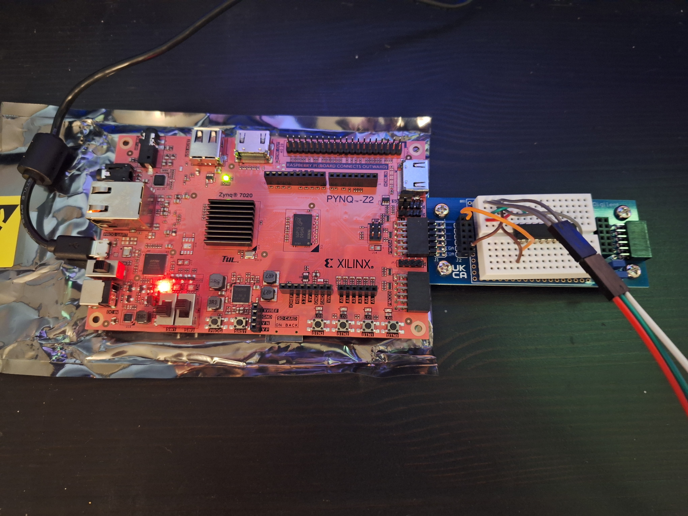
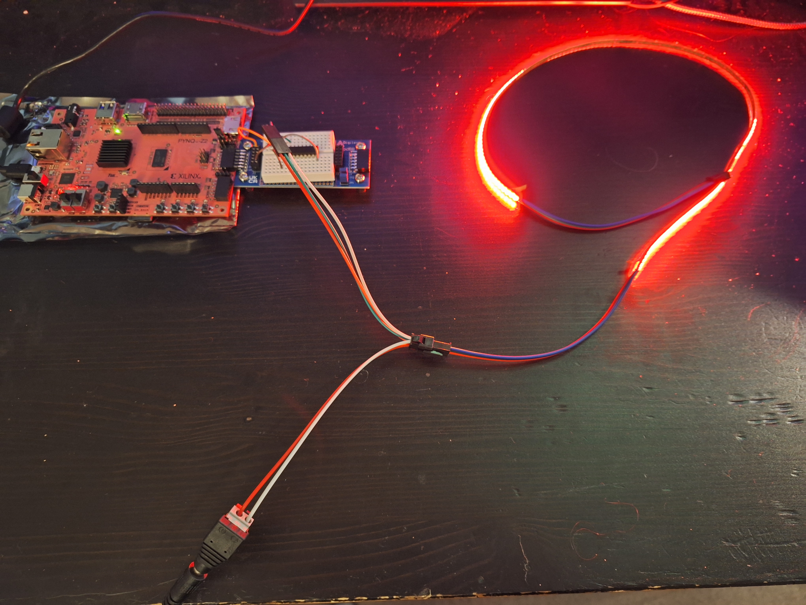
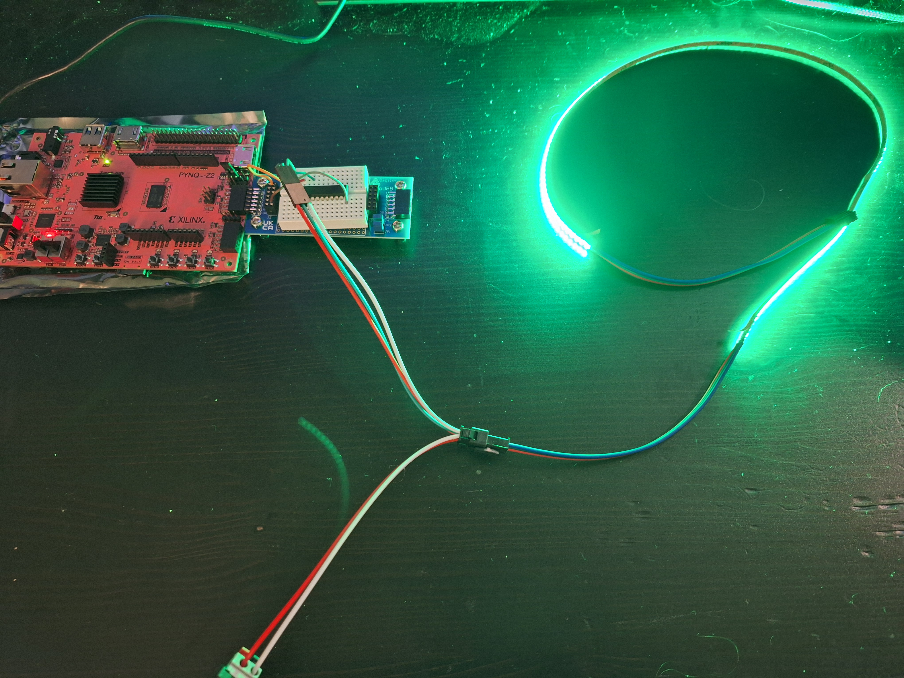
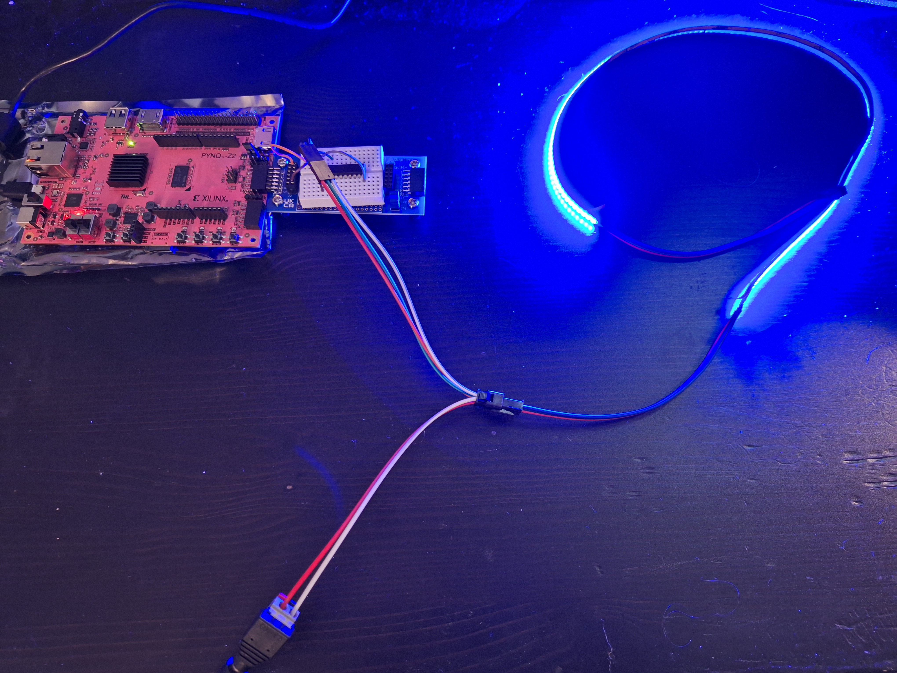
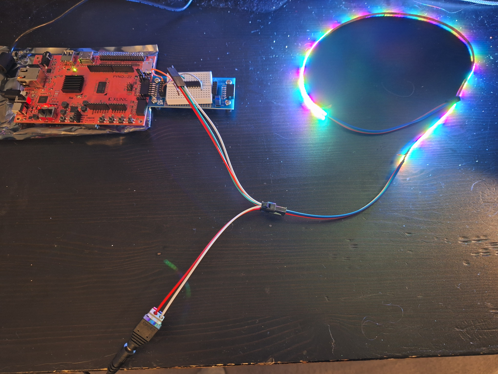

# Push Button
Implements the WS2812C driver with AXI Streaming user interface driven by push-button presets. The AXI-S interface is driven by push-buttons that send pre-baked colors to the LED strip: red, green, blue, and rainbow.

## Target Hardware
AMD/Xilinx PYNQ-Z2 FPGA development board, which includes a Zynq-7000 FPGA.

## Design

One of four LED pattern emitters send color information to the WS2812C driver using its repsective AXI-S interface. The four input streams are directed to the LED driver using an AXI-S switch. Each LED pattern emitter is driven by a constant, which is a [24*N] long constant. Every 24 bits of the constant is a 3-byte RGB code, with N colors making up the pattern. One of four push buttons acts as a trigger for each pattern emitter. The trigger causes the emitter to send a stream with the pattern as color data, repeated to fill 150 LEDs.

## Simulation Testbench
The simulation testbench includes a chain of 150 WS2812C models to act as the LED strip. It drives each of the push buttons in succession, waiting until all LEDs have been driven before moving to the next push button. LED colors and behavior are printed to the simulation console.

## Example Hardware

This example design was tested on hardware. The hardware setup included:

- PYNQ-Z2 board
- Digilent PMOD breadboard
- Texas Instruments SN74LS241N octal buffer
- WS2812C 0.5m 300/m LED strip from LEDLightingHut
- 5V DC power supply for LED strip

The WS2812C serial data output drives one pin of the PMOD A interface of the PYNQ board. A PMOD breadboard connects to PMODA, which breaks out the PMOD pins and contains the octal buffer that steps the data voltage from 3.3V to 5V. Jumper wires make the appropriate connections and connect data to the LED strip. 

Data, 5V Vdd, and GND connections are made using a 3-pin JST SM connector with separated power and ground lines for the breadboard. A 3-pin dupont socket is crimped to the data, power, and ground lines that connect to the JST SM and jumper wires crimped to a 3-pin dupont connector make the connection to the breadboard. The JST SM connects to the LED strip.

